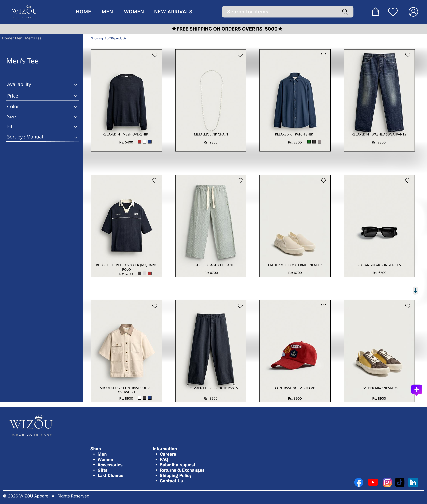
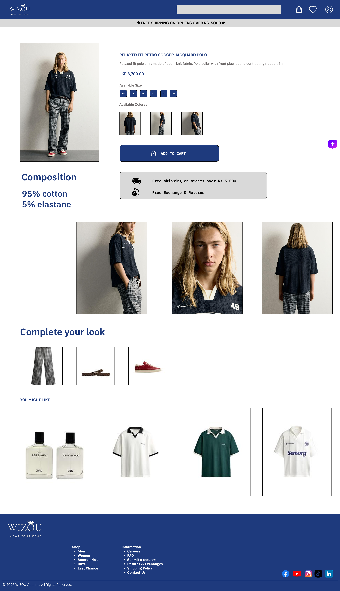
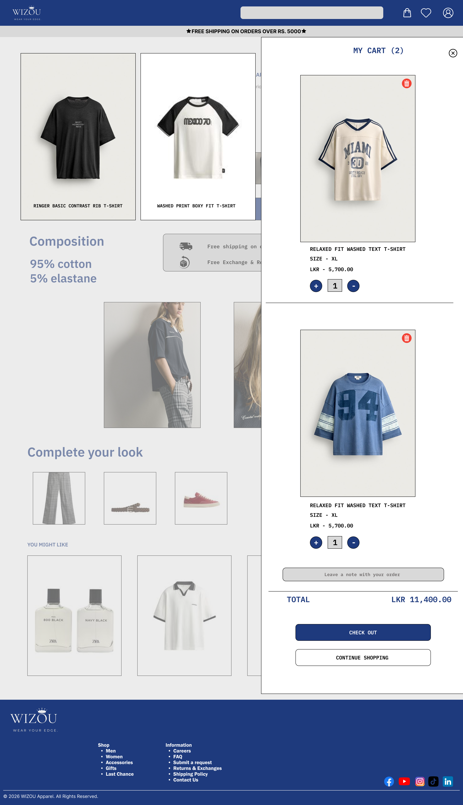
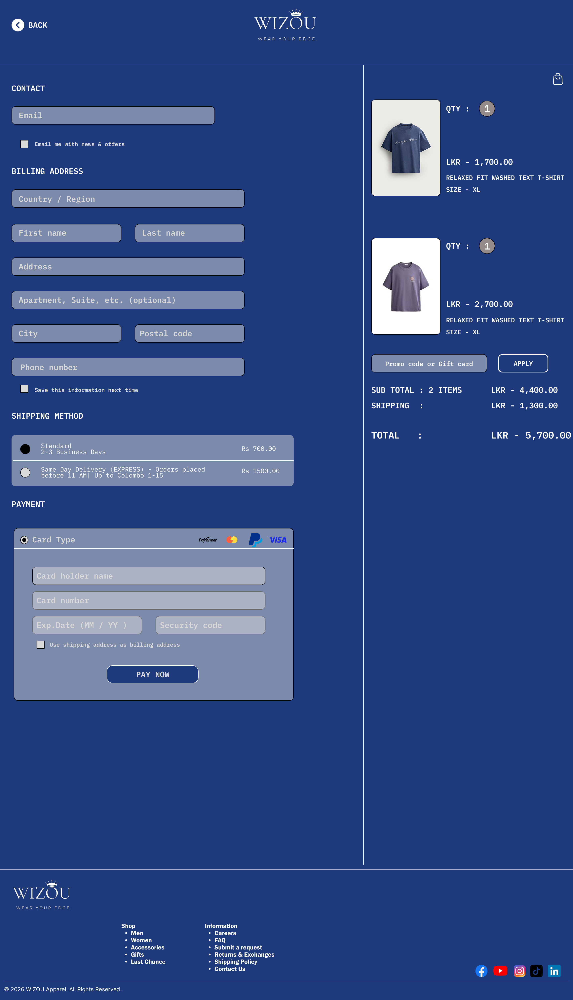

# 🛍️ WIZOU - Modern E-Commerce UI/UX Case Study

A minimal, high-end E-commerce website UI design created for **WIZOU Apparel**, featuring a complete shopping flow from product discovery to checkout. Designed with a focus on modern aesthetic, smooth user experience, and seamless visual hierarchy.

---

## 🎨 Brand & Design System

* **Primary Color:** `#0B1F3B` (Dark Navy Blue)
* **Secondary Color:** `#FFFFFF` (Pure White)
* **Typography:** Clean Sans-Serif / Monospace Accents
* **Design Aesthetic:** Minimalist, Grid-Aligned, Contrast-Driven

---

## 📱 User Experience Flow & Screens

### 1. Home / Landing Page
* Hero Section with High-Impact Brand Identity
* Category Navigation & Featured Collections

### 2. Product Listing Page (Shop Page)
* Custom Filtering Options (Availability, Price, Color, Size, Fit)
* Grid System with Color Swatches & Wishlist Features

### 3. Product Detail Page (PDP)
* High-Resolution Image Gallery
* "Complete Your Look" Cross-Selling Feature
* Interactive Size/Color Selection & Accordion Specs

### 4. Interactive Shopping Cart Drawer
* Slide-in Cart Overlay
* Real-time Total Calculation, Quantity Adjustments, & Order Notes

### 5. Checkout & Payment Page
* Split-Screen Layout for Address & Payment Processing
* Express Checkout Integration & Order Summary

---

## 📸 Screenshots Showcase

---

## 🛠️ Tools Used
* **Figma** - UI/UX Design & Prototyping
* **Git/GitHub** - Portfolio Case Study Hosting

---
© 2026 WIZOU Apparel UI Design Case Study. Designed for Portfolio Showcase.
